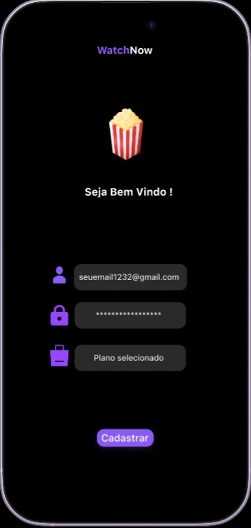
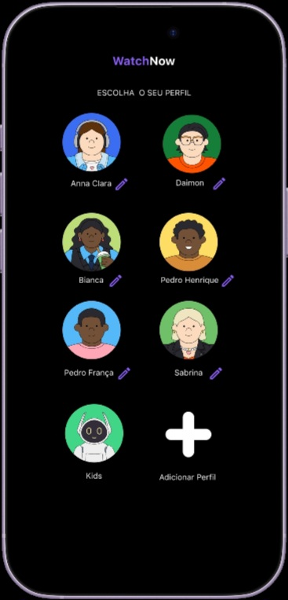
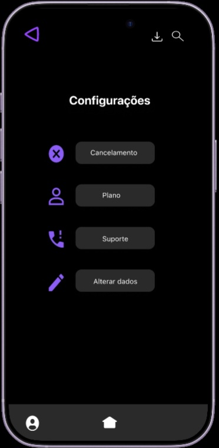
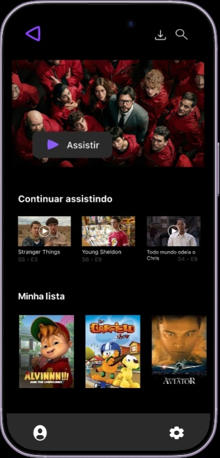
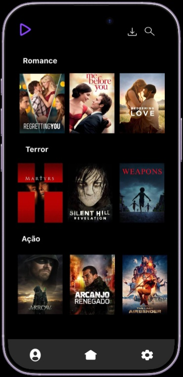

# Projeto-UX-plataforma-de-streaming-

🎬 Projeto UX — Plataforma de Streaming

📌 Sobre o projeto

Protótipo de média fidelidade de uma plataforma de streaming de séries e filmes, desenvolvido no Figma.

O projeto foi criado com foco na experiência do usuário, explorando a navegação, descoberta de conteúdos e interação com a interface de uma plataforma de streaming.

🎯 Objetivo

Criar uma experiência de navegação simples e intuitiva, permitindo que o usuário explore filmes e séries e interaja com as principais telas da plataforma por meio de um protótipo navegável.

🛠️ Ferramenta

- 🎨 Figma

💡 Principais funcionalidades do protótipo

- 🔎 Exploração e descoberta de filmes e séries
- 🎬 Visualização das informações dos conteúdos
- ▶️ Simulação da interação de reprodução
- 🧭 Navegação entre diferentes telas
- 📱 Interface desenvolvida com foco em dispositivos móveis
- ✨ Experiência de navegação inspirada em plataformas de streaming

«Observação: o projeto é um protótipo desenvolvido no Figma. As interações simulam a experiência de uso da plataforma, mas não possuem reprodução real de filmes ou séries.»

🎨 Projeto no Figma

"🔗 Visualizar protótipo no Figma" (https://www.figma.com/proto/qHulN9C6qTfs43mLc942jX/Sem-t%C3%ADtulo?node-id=1-2&p=f&t=sS0pdVy0B2NXDnPJ-1&scaling=scale-down&content-scaling=fixed&page-id=0%3A1&starting-point-node-id=1%3A2&show-proto-sidebar=1)

## 🖼️ Imagens do projeto

  
  
  

  
  
  

📚 Área de estudo

Projeto desenvolvido durante os estudos de UX/UI Design, com foco em prototipação, navegação e experiência do usuário.
